# 🔄 System Flow Documentation

## 🚀 **Advanced Computer Vision Security System - Complete Flow**

This document provides a comprehensive overview of the system flow, data processing pipeline, and component interactions in the Advanced Computer Vision Security System.

---

## 📋 **Table of Contents**

1. [System Overview](#system-overview)
2. [Initialization Flow](#initialization-flow)
3. [Main Processing Loop](#main-processing-loop)
4. [Frame Processing Pipeline](#frame-processing-pipeline)
5. [Detection Algorithms Flow](#detection-algorithms-flow)
6. [Analytics & Monitoring Flow](#analytics--monitoring-flow)
7. [Data Flow Diagram](#data-flow-diagram)
8. [Component Interactions](#component-interactions)
9. [Error Handling Flow](#error-handling-flow)
10. [Performance Optimization Flow](#performance-optimization-flow)

---

## 🎯 **System Overview**

The Advanced Computer Vision Security System follows a modular, pipeline-based architecture designed for real-time video processing with multiple detection algorithms, performance monitoring, and analytics.

### **Core Components**
- **Video Input**: Camera or video file capture
- **Detection Layer**: Motion, person, and object detection
- **Tracking Layer**: Object tracking and identity maintenance
- **Analytics Layer**: Performance monitoring and data analysis
- **Output Layer**: Visualization, evidence collection, and reporting

---

## 🔧 **Initialization Flow**

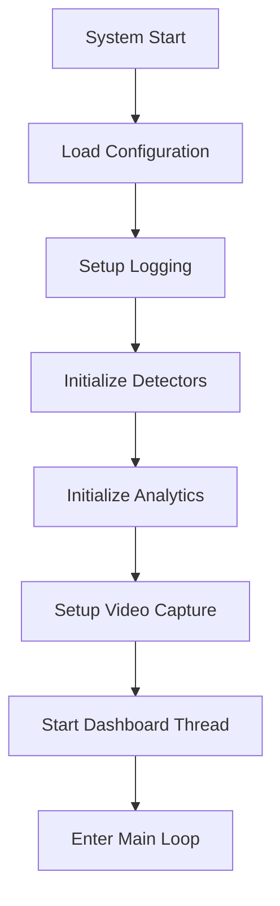

### **Step-by-Step Initialization**

1. **Configuration Loading**
   - Load `config.json` with system parameters
   - Validate configuration settings
   - Set default values for missing parameters

2. **Logging Setup**
   - Initialize logger with appropriate level
   - Set up log file rotation
   - Configure console and file output

3. **Detector Initialization**
   - Initialize Motion Detector (MOG2/KNN/GMG)
   - Initialize Person Detector (YOLO v3)
   - Initialize Object Tracker (CSRT/KCF/MOSSE)
   - Validate detector configurations

4. **Analytics Initialization**
   - Initialize Performance Monitor
   - Initialize Data Visualizer
   - Start Dashboard (if enabled)

5. **Video Capture Setup**
   - Open camera or video file
   - Set resolution and frame rate
   - Validate video source

---

## 🔄 **Main Processing Loop**

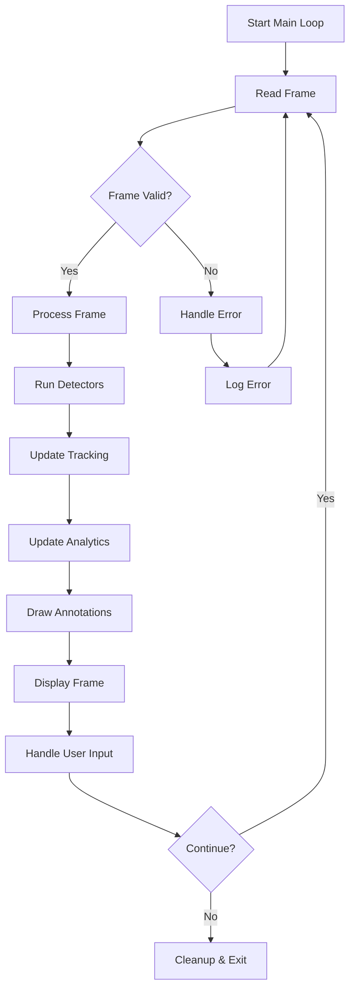

### **Main Loop Steps**

1. **Frame Capture**
   - Read frame from video source
   - Validate frame integrity
   - Handle end-of-file for video files

2. **Frame Processing**
   - Resize frame to target resolution
   - Run all enabled detectors
   - Update object tracking
   - Collect performance metrics

3. **Analytics Update**
   - Update performance monitor
   - Record detection statistics
   - Generate analytics data

4. **Visualization**
   - Draw detection bounding boxes
   - Add performance metrics overlay
   - Display system status

5. **User Interaction**
   - Handle keyboard input
   - Process control commands
   - Manage system state

---

## 🎬 **Frame Processing Pipeline**

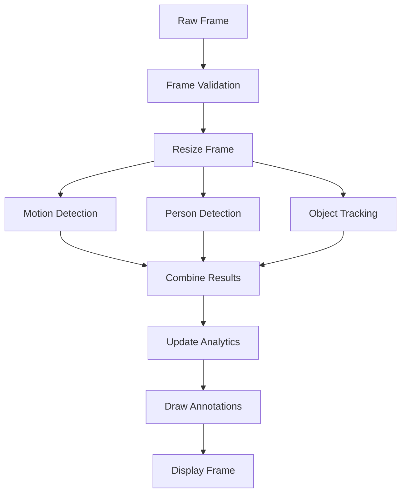

### **Frame Processing Steps**

1. **Input Validation**
   ```python
   # Check frame validity
   if frame is None or frame.size == 0:
       return error_response
   
   # Check frame dimensions
   if len(frame.shape) < 2 or frame.shape[0] == 0:
       return error_response
   ```

2. **Frame Preprocessing**
   ```python
   # Resize to target resolution
   target_size = tuple(self.config["output_resolution"])
   frame = cv2.resize(frame, target_size)
   ```

3. **Detection Processing**
   - Run motion detection algorithm
   - Run person detection algorithm
   - Update object tracking
   - Combine all detection results

4. **Post-processing**
   - Apply non-maximum suppression
   - Filter by confidence thresholds
   - Update tracking associations

---

## 🔍 **Detection Algorithms Flow**

### **Motion Detection Flow**

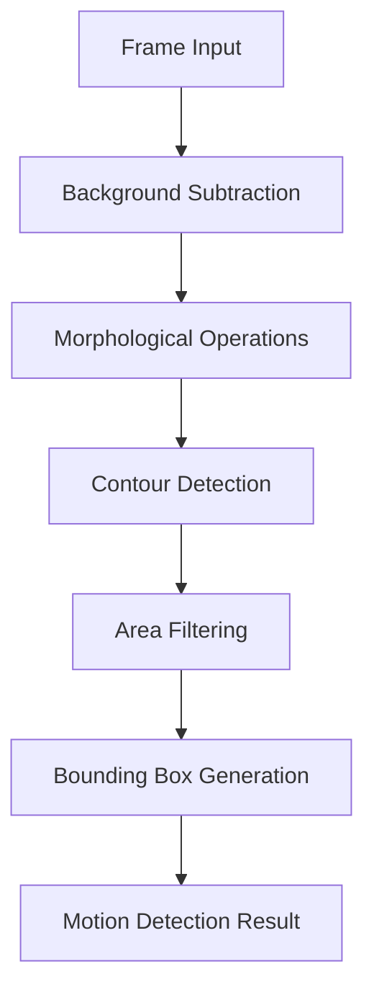

**Algorithm Details:**
- **MOG2**: Gaussian mixture model for background
- **KNN**: K-nearest neighbors for complex scenes
- **GMG**: Statistical background modeling

### **Person Detection Flow**

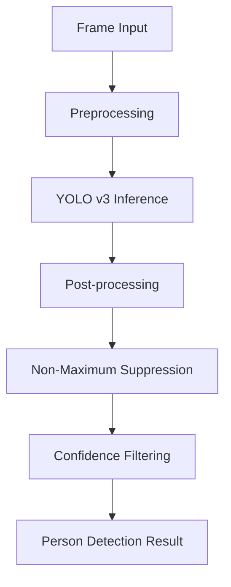

**Algorithm Details:**
- **Input**: 416x416 RGB image
- **Model**: YOLO v3 with Darknet backbone
- **Output**: Bounding boxes, confidence scores, class probabilities

### **Object Tracking Flow**

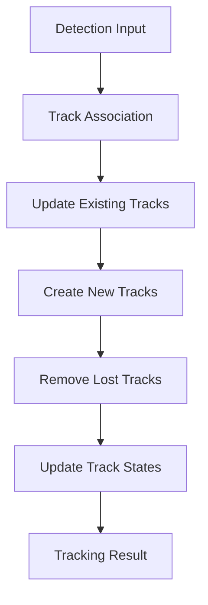

**Algorithm Details:**
- **CSRT**: Channel and spatial reliability
- **KCF**: Kernelized correlation filter
- **MOSSE**: Minimum output sum of squared error

---

## 📊 **Analytics & Monitoring Flow**

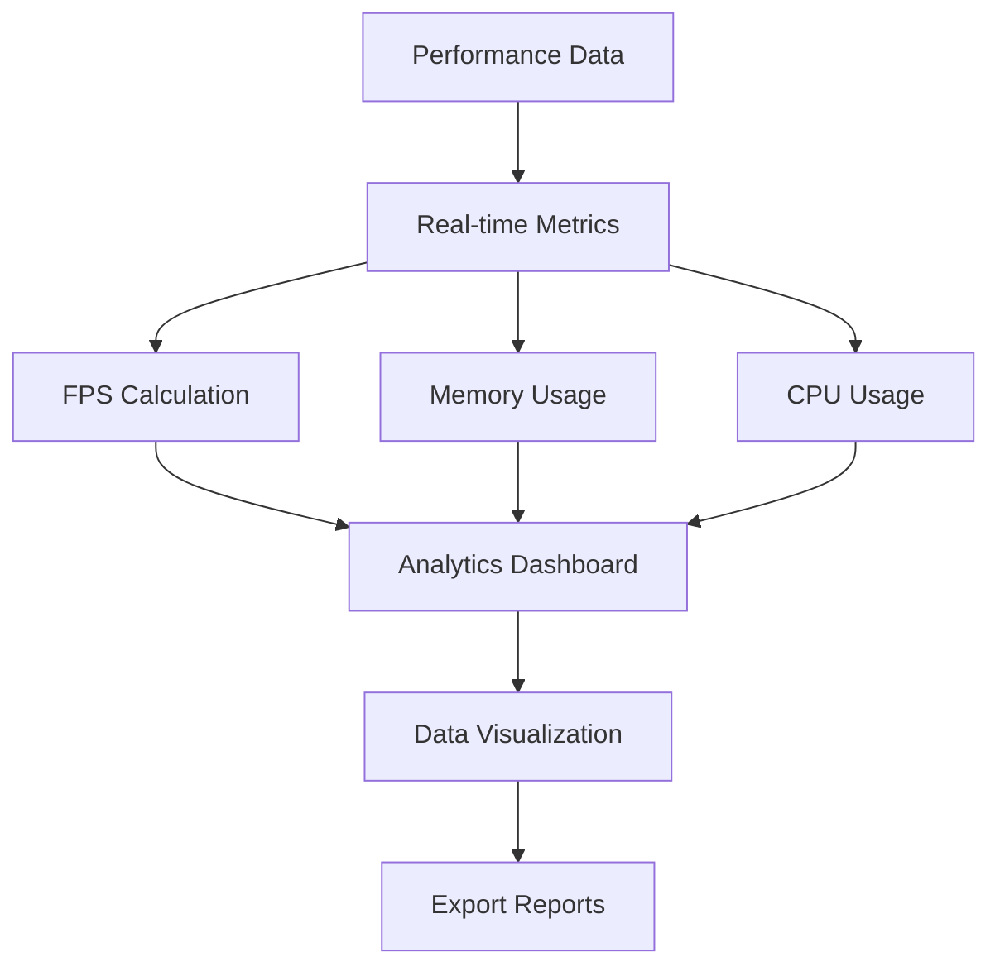

### **Analytics Components**

1. **Performance Monitor**
   - FPS tracking
   - Memory usage monitoring
   - CPU utilization
   - Detection timing

2. **Data Visualizer**
   - Real-time charts
   - Historical analysis
   - Statistical summaries
   - Interactive dashboard

3. **Report Generation**
   - JSON export
   - CSV data export
   - Performance reports
   - Detection summaries

---

## 🔄 **Data Flow Diagram**

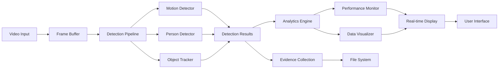

---

## 🔗 **Component Interactions**

### **Class Dependencies**

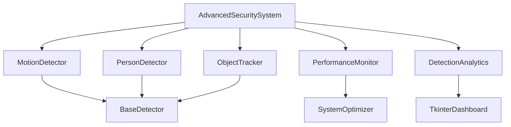

### **Data Flow Between Components**

1. **Main System** → **Detectors**: Frame data
2. **Detectors** → **Main System**: Detection results
3. **Main System** → **Tracker**: Detection results
4. **Tracker** → **Main System**: Tracking results
5. **Main System** → **Analytics**: Performance data
6. **Analytics** → **Dashboard**: Visualization data

---

## ⚠️ **Error Handling Flow**

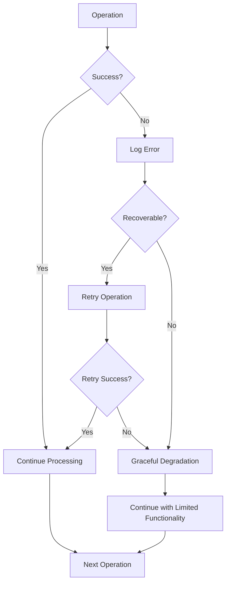

### **Error Handling Strategies**

1. **Frame Processing Errors**
   - Skip invalid frames
   - Log error details
   - Continue with next frame

2. **Detector Errors**
   - Disable failed detector
   - Continue with remaining detectors
   - Log detector status

3. **System Errors**
   - Graceful shutdown
   - Save current state
   - Generate error report

---

## ⚡ **Performance Optimization Flow**

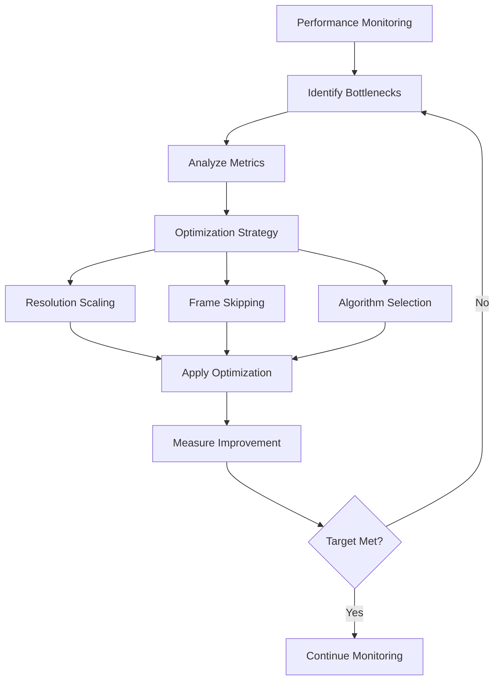

### **Optimization Techniques**

1. **Resolution Scaling**
   - Reduce frame size for better performance
   - Maintain detection accuracy
   - Adaptive scaling based on load

2. **Frame Skipping**
   - Skip frames during high load
   - Maintain real-time performance
   - Intelligent frame selection

3. **Algorithm Selection**
   - Choose fastest algorithm for conditions
   - Balance speed and accuracy
   - Dynamic algorithm switching

---

## 🎯 **Key System Characteristics**

### **Real-time Processing**
- **Frame Rate**: 15-25 FPS (configurable)
- **Latency**: 20-50ms per frame
- **Memory Usage**: 200-500 MB
- **CPU Usage**: 30-60%

### **Scalability Features**
- **Modular Architecture**: Easy to add new detectors
- **Configuration-driven**: Runtime parameter adjustment
- **Multi-threading**: Parallel processing for analytics
- **Resource Management**: Automatic cleanup and optimization

### **Reliability Features**
- **Error Recovery**: Graceful handling of failures
- **State Persistence**: Save/restore system state
- **Comprehensive Logging**: Detailed error tracking
- **Performance Monitoring**: Real-time system health

---

## 🚀 **Usage Flow Examples**

### **Basic Detection Demo**
```bash
python3 advanced_security_system.py --camera 0
```

### **Video File Analysis**
```bash
python3 advanced_security_system.py --video raw_cctv/test.mp4
```

### **Interactive Demo**
```bash
python3 demo_script.py
```

### **ML Training Demo**
```bash
python3 training_demo.py
```

---

This system flow documentation provides a complete understanding of how the Advanced Computer Vision Security System processes data, handles errors, and optimizes performance for real-time video analysis. The modular architecture ensures maintainability and extensibility while the comprehensive monitoring provides insights into system performance and behavior.
